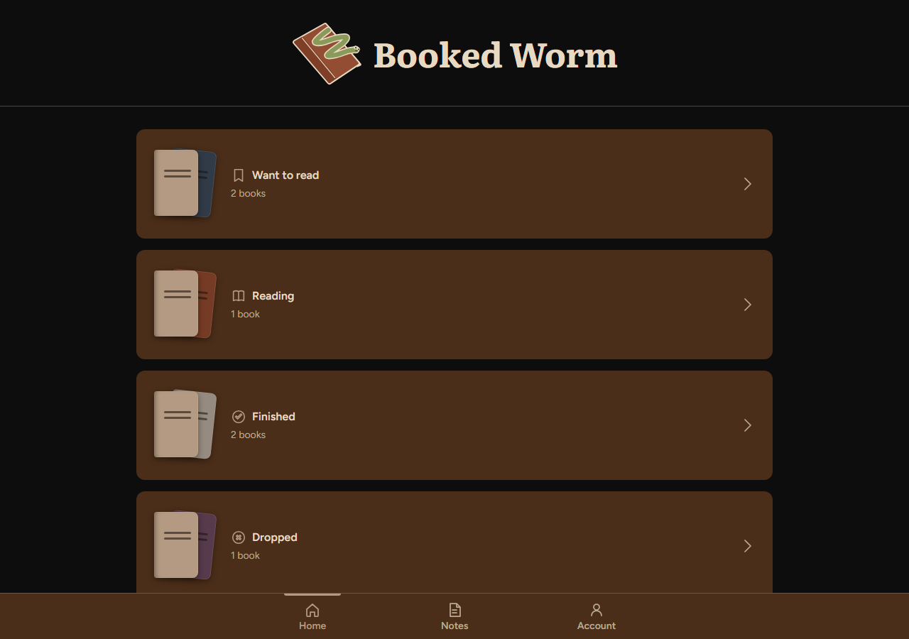
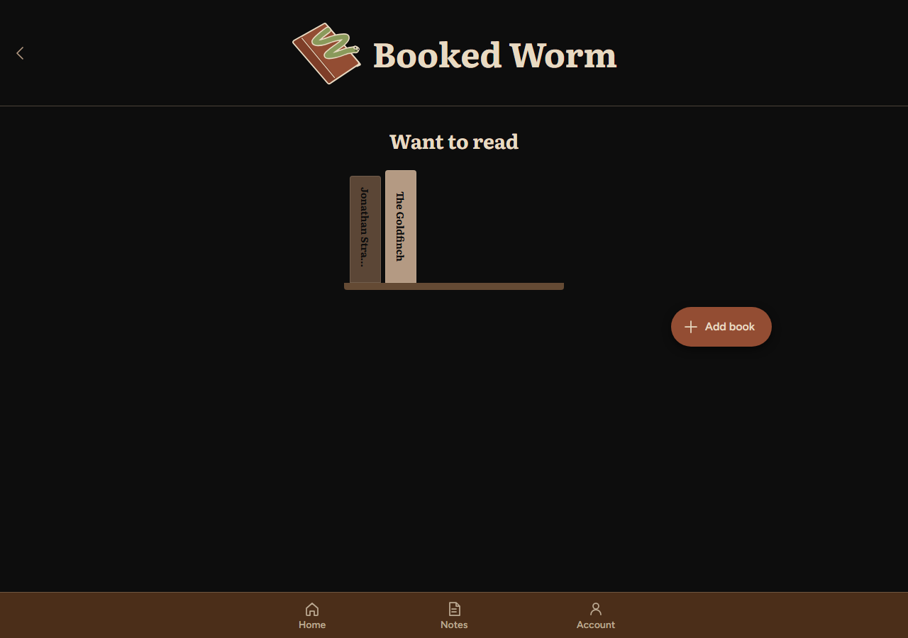
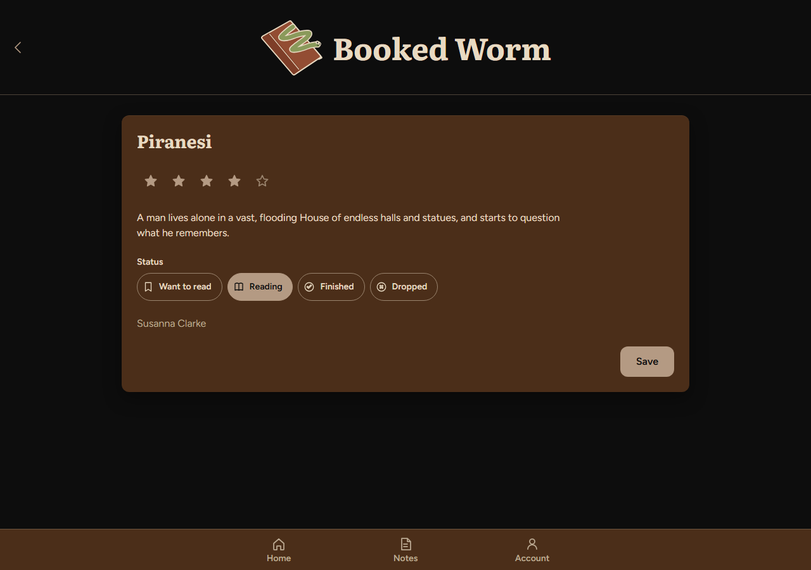

# Booked Worm

## 1. Overview

Booked Worm is a reading tracker. Users add the books they want to read and
update each book's status (Want to read, Reading, Finished, Dropped) as they
go, rate it, and write notes tied to a specific book. It's for anyone who
reads several books at once and loses track of where they left off.

## 2. Setup and installation

**Install first:** [Node.js](https://nodejs.org/) 18 or newer, and `npm`
(comes with Node). PostgreSQL 16 or newer will be needed once the real
backend is built, either local or hosted.

**Get the code:**

```bash
git clone https://github.com/jeirld/BookedWorm.git
cd BookedWorm
```

**Install dependencies (client only, for now):**

```bash
cd client
npm install
```

**Environment and configuration.** Copy `client/.env.example` to
`client/.env`. Nothing needs to change to run it as it is right now.

| Name | Where | What it is |
| --- | --- | --- |
| `VITE_USE_MOCK_API` | client, build time | only the exact value `false` turns the simulated backend off; unset or `true` means it's on |
| `VITE_API_BASE_URL` | client, build time | the real API's URL, once it exists. No trailing slash |
| `DATABASE_URL` | server (not wired up yet) | PostgreSQL connection string |
| `CORS_ORIGINS` | server (not wired up yet) | comma-separated origins allowed to call the API |
| `NODE_ENV` | server (not wired up yet) | `production` on a real host |
| `PORT` | server (not wired up yet) | set by the host, not by hand |

Every `VITE_` value is compiled into the built JavaScript and is **public**.
Never put a key, a password, or a connection string in one.

**Database setup and seeding.** Not needed yet. The app currently saves to
the browser's own storage, seeded from `client/src/api/seed.json` the first
time it loads. There is no real database to set up until the backend exists.

## 3. How to run it

```bash
cd client
npm install
npm run dev
```

Open **http://localhost:5173**. The first thing you should see is the Home
screen: four rows, one per status, each showing a book count.

## 4. Features and usage

Home - shows the four statuses as a list. Tapping one opens that shelf.

Shelf - shows the books in that status as spines on a shelf. Tap a book to
open it, or use the Add book button.

Book details - shows the title, star rating, blurb, status, and author.
Change the rating or status and press Save; the screen stays open so you can
keep adjusting.

Add book - is a form for the title, author, an optional blurb, a status,
and an optional rating. Saving sends you to the shelf matching the status you
picked.

Notes - lists notes as cards. Tapping one asks whether you want to read or
edit it, then opens the matching view.

Account - shows the username, join date, and a biography you can edit.

**API (planned, not live yet).** `client/src/api/httpApi.js` already defines
the endpoints the real backend needs to implement:

| Method | Path | What it does |
| --- | --- | --- |
| GET | `/api/books` | list all books |
| POST | `/api/books` | add a book |
| PATCH | `/api/books/:id` | update a book (status, rating, etc.) |
| DELETE | `/api/books/:id` | remove a book |
| GET | `/api/notes` | list all notes |
| POST | `/api/notes` | add a note |
| PATCH | `/api/notes/:id` | update a note |
| DELETE | `/api/notes/:id` | remove a note |
| GET | `/api/profile` | get the single profile row |
| PATCH | `/api/profile` | update the profile |

## 5. Project structure

```
client/
  src/
    api/          one interface (index.js), two implementations:
                   mockApi.js (browser storage) and httpApi.js (real API)
    components/   the design system's components (Button, StarRating, ...)
    pages/        one file per screen (Home, Shelf, BookDetails, ...)
    styles/       tokens.css, components.css (design system), layout.css
    utils/        small helpers (statuses, spine colours/heights)
server/           Express + PostgreSQL starter (not yet adapted to books)
docs/             planning documents and weekly reports
```

## 6. Screenshots

Home:



Shelf:



Book details:



## 7. Known issues and next steps

- No real backend yet.
- Nothing is deployed The GitHub Pages workflow is set up but hasn't
  been triggered, and there's no API or database host yet.
- No delete UI. The API layer already has deleteBook/deleteNote, but
  no button calls them yet.
- No login The app assumes a single user for now; the profile table
  is shaped so a real login can be added later without a rewrite.
- Next: build the Express routes and PostgreSQL schema, deploy all three
  pieces, then add delete buttons and any remaining polish.

## AI use

This project was built with AI assistance.


Full account in [AI-USAGE.md](AI-USAGE.md).
