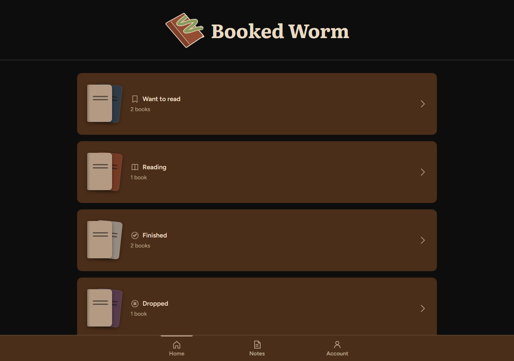
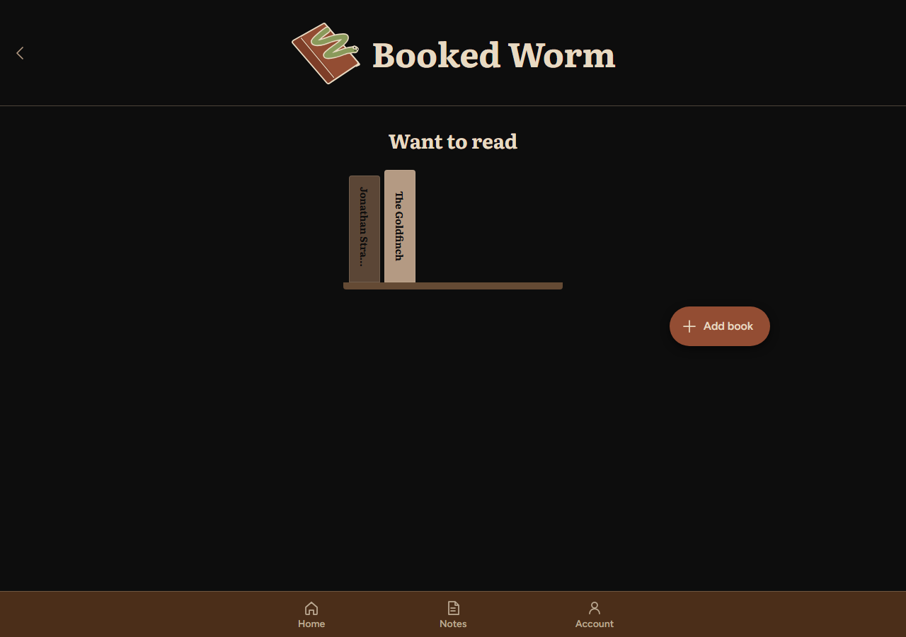
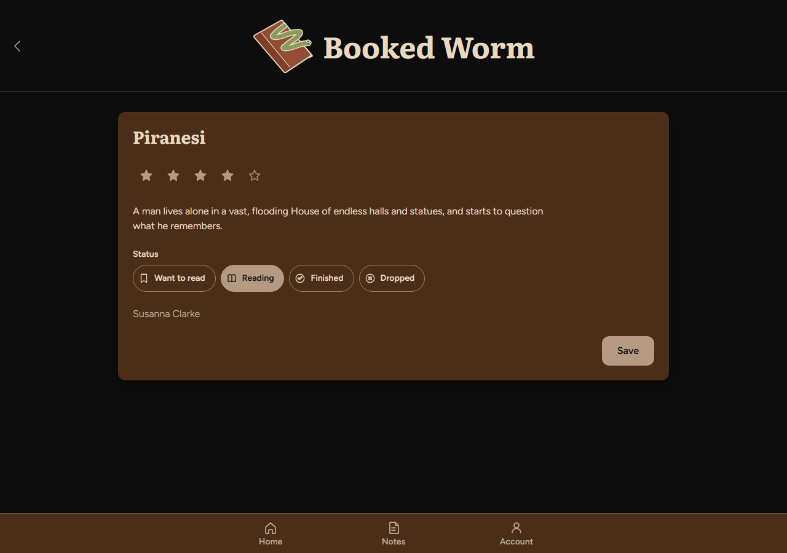

# Booked Worm

## 1. Overview

Booked Worm is a reading tracker. Users add the books they want to read and
update each book's status (Want to read, Reading, Finished, Dropped) as they
go, rate it, and write notes tied to a specific book. Everyone signs up for
their own account and gets their own private library. It's for anyone who
reads several books at once and loses track of where they left off.

- Live site: https://jeirld.github.io/BookedWorm/
- API health check: https://bookedworm.onrender.com/healthz
- Code: https://github.com/jeirld/BookedWorm

The API runs on Render's free tier, which sleeps when idle. The first request
after a quiet spell can take up to a minute while it wakes up.

## 2. Setup and installation

**Install first:** [Node.js](https://nodejs.org/) 18 or newer, and `npm`
(comes with Node). PostgreSQL 16 or newer is only needed if you want to run
the real backend yourself, either local or hosted.

**Get the code:**

```bash
git clone https://github.com/jeirld/BookedWorm.git
cd BookedWorm
```

**Install dependencies:**

```bash
cd client
npm install
cd ../server
npm install
```

**Environment and configuration.** Copy `client/.env.example` to
`client/.env`. Nothing needs to change to run the client on its own. To run
the real backend too, copy `server/.env.example` to `server/.env` and set
`DATABASE_URL`.

| Name | Where | What it is |
| --- | --- | --- |
| `VITE_USE_MOCK_API` | client, build time | only the exact value `false` turns the simulated backend off; unset or `true` means it's on |
| `VITE_API_BASE_URL` | client, build time | the real API's URL, once it exists. No trailing slash |
| `DATABASE_URL` | server | PostgreSQL connection string |
| `CORS_ORIGINS` | server | comma-separated origins allowed to call the API |
| `NODE_ENV` | server | `production` on a real host |
| `PORT` | server | set by the host, not by hand |

Every `VITE_` value is compiled into the built JavaScript and is **public**.
Never put a key, a password, or a connection string in one.

**Database setup and seeding.** The schema (`server/db/schema.sql`) and a demo
account with four sample books (`server/db/seed.js`) are loaded with
`npm run db:reset` from `server/`, which needs `DATABASE_URL` set. The live site
uses a hosted PostgreSQL database on Neon.

**Demo account.** Username `bookworm`, password `readmore123`. Anyone can also
sign up for their own account.

## 3. How to run it

```bash
cd client
npm install
npm run dev
```

Open **http://localhost:5173**. The first thing you should see is the Home
screen: four rows, one per status, each showing a book count.

That runs on the mock API (browser storage). To use the real API locally, start
the server in a second terminal with `cd server`, then `npm run dev` (it
listens on port 3000), and set `VITE_USE_MOCK_API=false` in `client/.env`.

## 4. Features and usage

Log in / Sign up - the first screen when you're signed out. Usernames are 3 to
30 characters (letters, numbers, dots, dashes, underscores) and passwords need
at least 8 characters. Each account only ever sees its own books and notes.

Home - shows the four statuses as a list. Tapping one opens that shelf. The
search box at the top finds books by title or author across all statuses.

Shelf - shows the books in that status as spines on a shelf. Tap a book to
open it, or use the Add book button.

Book details - shows the title, star rating, blurb, status, and author.
Change the rating or status and press Save; the screen stays open so you can
keep adjusting. Delete removes the book (after a confirmation) and takes you
back to its shelf; the book's notes are deleted with it.

Add book - is a form for the title, author, an optional blurb, a status,
and an optional rating. Saving sends you to the shelf matching the status you
picked.

Notes - lists notes as cards. Tapping one asks whether you want to read or
edit it, then opens the matching view. Delete is in the edit view, with a
confirmation.

Account - shows the username, join date, a biography you can edit, and how many
books you have in each status. Log out is at the bottom, next to Delete account,
which asks for your password and then removes your account, books and notes for
good. The public demo account cannot be deleted.

**API.** The Express server in `server/server.js`
implements the endpoints `client/src/api/httpApi.js` calls:

| Method | Path | What it does |
| --- | --- | --- |
| POST | `/api/auth/register` | create an account, returns a login token |
| POST | `/api/auth/login` | log in, returns a login token |
| POST | `/api/auth/logout` | end the current login |
| GET | `/api/books` | list your books; add `?search=text` to filter by title or author |
| GET | `/api/stats` | how many of your books are in each status |
| POST | `/api/books` | add a book |
| PATCH | `/api/books/:id` | update a book (status, rating, etc.) |
| DELETE | `/api/books/:id` | remove a book |
| GET | `/api/notes` | list all notes |
| POST | `/api/notes` | add a note |
| PATCH | `/api/notes/:id` | update a note |
| DELETE | `/api/notes/:id` | remove a note |
| GET | `/api/profile` | get your profile |
| PATCH | `/api/profile` | update your profile |
| DELETE | `/api/profile` | delete your account (needs your password) |

Everything except register and login needs an `Authorization: Bearer <token>`
header, and only returns or changes the signed-in user's own rows.

## 5. Project structure

```
client/
  src/
    api/          one interface (index.js), two implementations:
                   mockApi.js (browser storage) and httpApi.js (real API)
    components/   the design system's components (Button, StarRating, ...)
    pages/        one file per screen (Home, Shelf, BookDetails, ...)
    styles/       tokens.css, components.css (design system), layout.css
    utils/        small helpers (statuses, spine colours/heights)
server/           Express + PostgreSQL: routes, auth.js (passwords and
                   logins), repo files (SQL queries), and db/ (schema, seed)
docs/             proposal, mockup, design system, demo video plan,
                   security notes, and weekly reports
```

## 6. Screenshots

Home:



Shelf:



Book details:



Every screen, including the empty states, is in [docs/02-mockup.md](docs/02-mockup.md).

## 7. Known issues and next steps

- All three pieces are deployed: the client on GitHub Pages, the API on
  Render, and the database on Neon.
- The free API host sleeps when idle, so the first load after a quiet
  spell is slow.
- Accounts are basic: no password reset, no email, and no way to change
  a password yet. You can delete your account. The login token is kept in the browser's local storage.
- The security checklist is done ([SECURITY-CHECKLIST.md](SECURITY-CHECKLIST.md)):
  the API uses `helmet`, rate limits login and signup, and `npm audit`
  reports no vulnerabilities.
- Next steps: password reset and change, automated tests for the API, and
  sort on the shelves.

## AI use

This project was built with AI assistance.


Full account in [AI-USAGE.md](AI-USAGE.md).
