# Mockup

What the app looks like, with the real colours, type, spacing and content. These
are images of the built app at phone width (390px), taken 2026-10-09. The
original wireframe sketches were hand-drawn and are not redone here.

## Signed out

| Log in | Sign up |
| --- | --- |
| 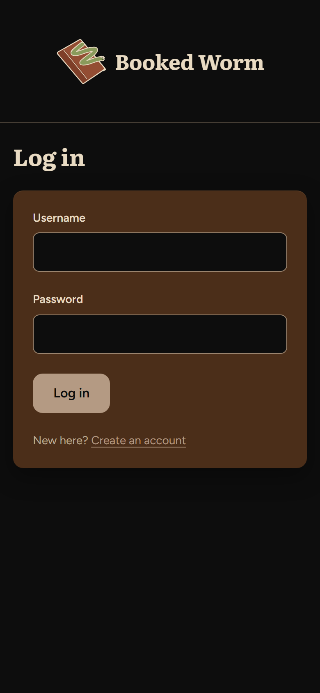 | 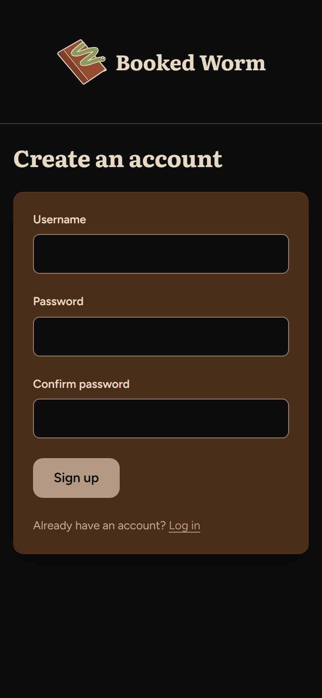 |

## Main screens

| Home | Shelf | Book details |
| --- | --- | --- |
| 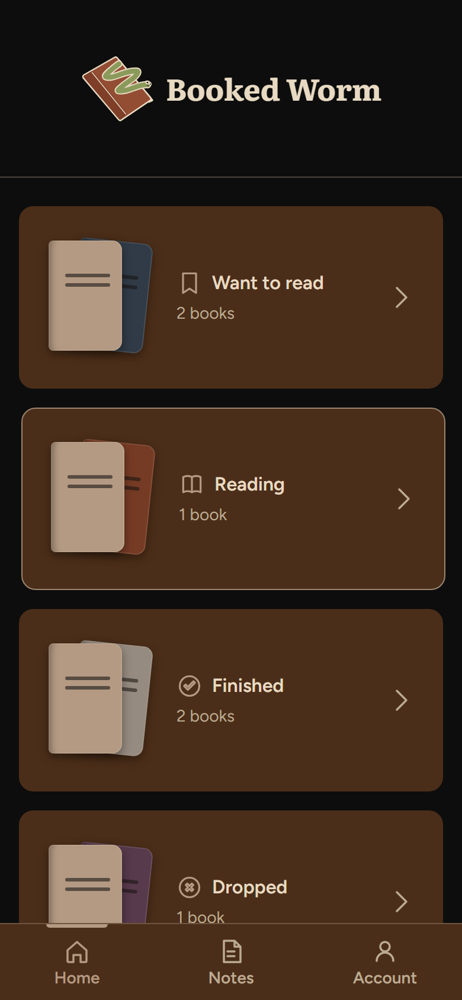 | 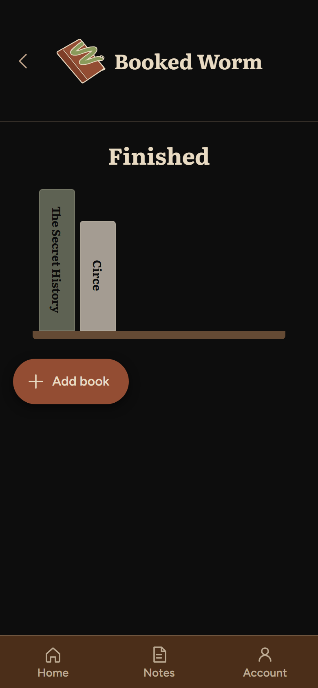 | 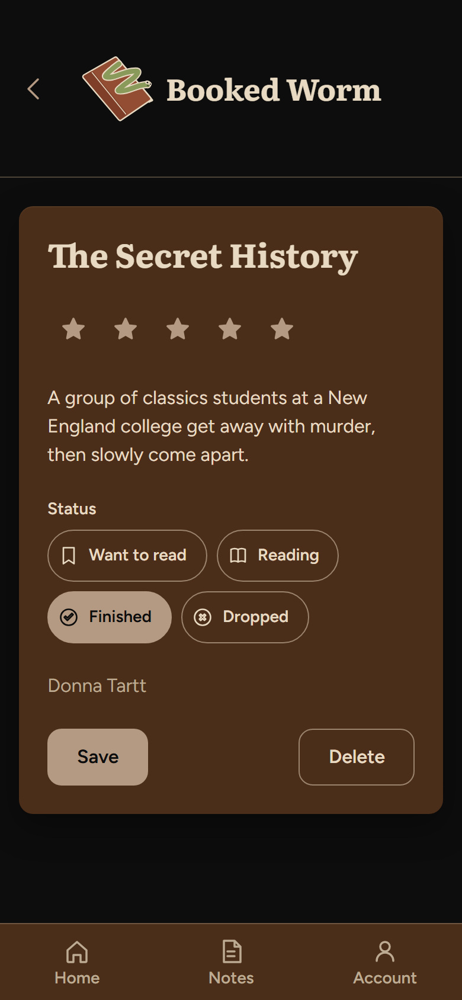 |

| Add book | Notes | Note dialog |
| --- | --- | --- |
| 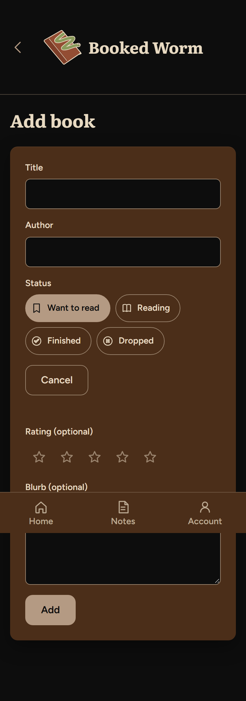 | 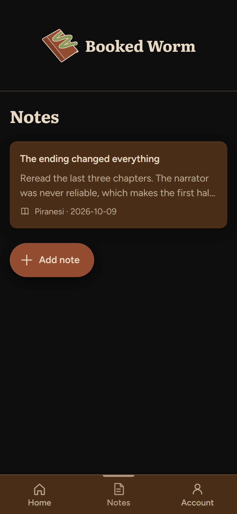 | 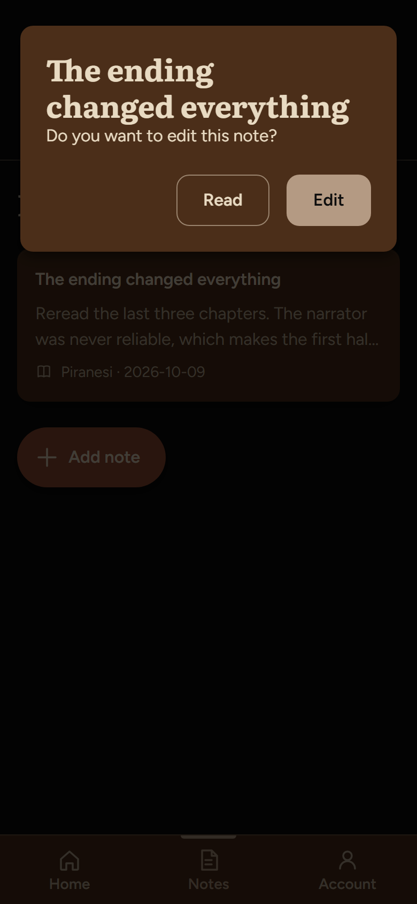 |

| New note | Account |
| --- | --- |
| 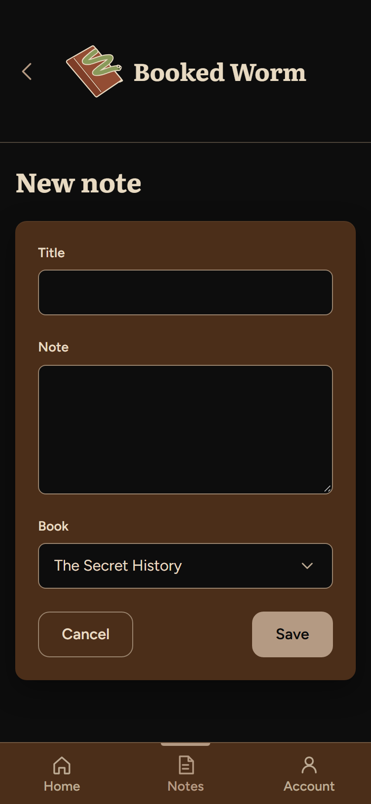 | 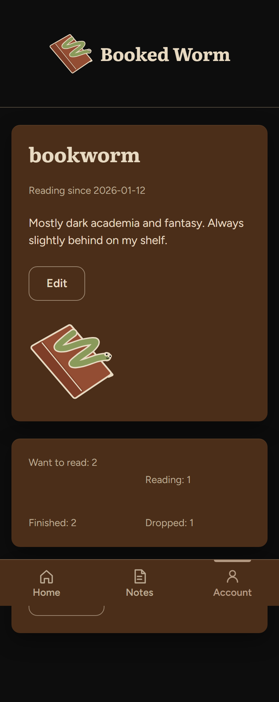 |

## Empty states

A new account has no books or notes. Each screen says what to do next instead of
showing a blank page.

| Home | Shelf | Notes |
| --- | --- | --- |
| 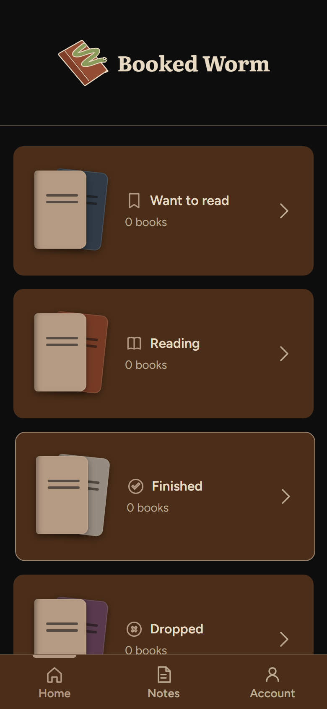 | 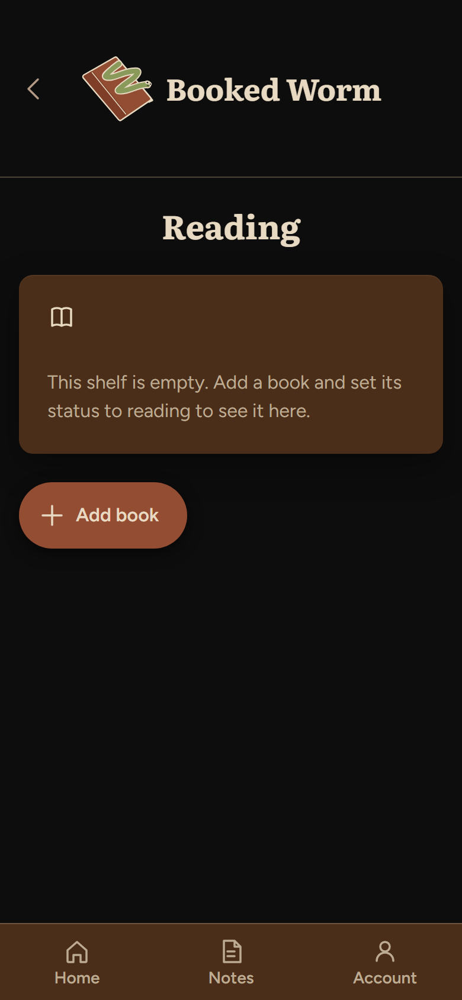 | 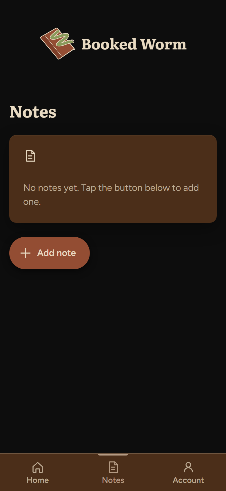 |

## Desktop

On a wide screen the Add book form uses two columns, as in the sketch.

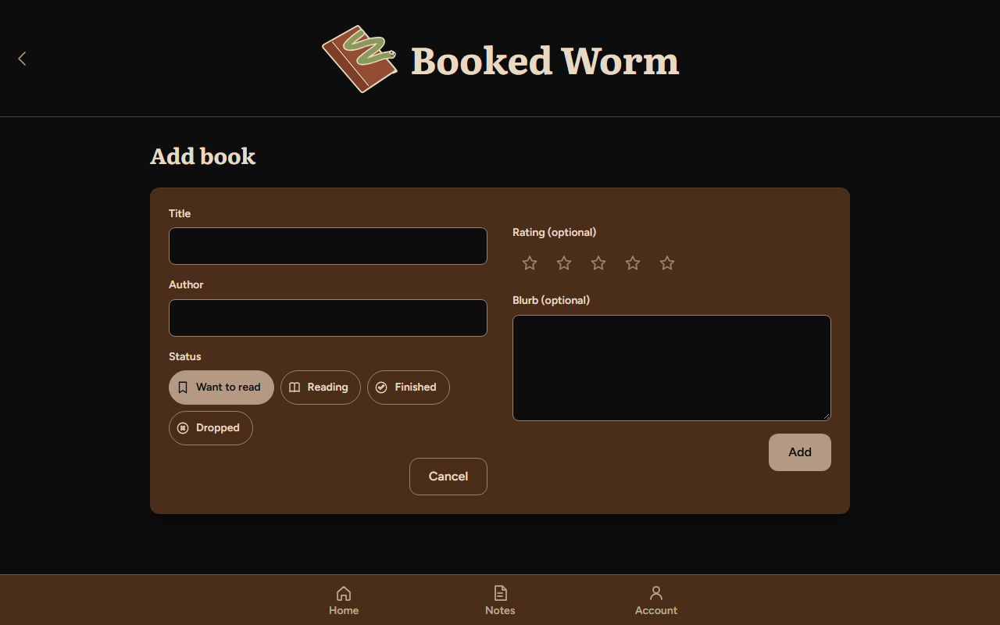

## Honest note

The screens above are the same seven screens as in the proposal, plus the two
signed-out screens (Log in, Sign up) that were added with accounts. Nothing from
the wireframes was left out. Things that changed from the sketches while building:
the Home page became a vertical list of status rows, a shelf holds exactly six
books before spilling onto a second plank, and the header was made taller to fit
a bigger logo.
