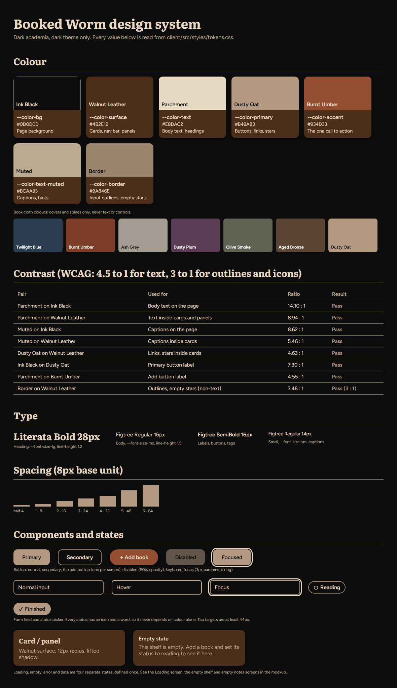

# Design system

Dark academia, dark theme only. The rules are written once in CSS custom
properties so screen four looks like screen one.

## Colour

Every colour, its hex, and the name used in code.

| Token | Hex | Name | Role |
| --- | --- | --- | --- |
| `--color-bg` | `#0D0D0D` | Ink Black | Page background |
| `--color-surface` | `#4B2E19` | Walnut Leather | Cards, nav bar, panels |
| `--color-text` | `#E8DAC2` | Parchment | Body text and headings |
| `--color-primary` | `#B49A83` | Dusty Oat | Links, buttons, active states, stars |
| `--color-accent` | `#934D33` | Burnt Umber | The one call to action, error icon |
| `--color-text-muted` | `#BCAA93` | | Captions, hints |
| `--color-border` | `#9A846E` | | Input outlines, empty stars |

Six more "cloth" colours (`--cloth-blue`, `-umber`, `-ash`, `-plum`, `-olive`,
`-bronze`, plus Dusty Oat as the seventh) are used only for book covers and
spines, never for text or controls.

**Contrast.** Checked against WCAG: all text pairs are above 4.5 to 1 (lowest is
Parchment on Burnt Umber at 4.55) and non-text outlines are above 3 to 1. The full
table is in the image above.

## Type

Literata Bold 700 for headings, Figtree for everything else (400 for body, 600 for
labels, buttons and tags). Three sizes: 28px heading, 16px body, 14px small.

## Spacing

One scale on an 8px base: 4, 8, 16, 24, 32, 48, 64 (`--space-half` to
`--space-6`). Screen edge padding is 16px on a phone and 32px on desktop (768px
and up).

## Components

Twelve from the original spec: Button, AddButton, StatusTag, StarRating,
FormField, StatusPicker, StatusCard, BookSpine, NoteCard, Header, BottomNav and
NoteDialog, plus a small hand-built Icon set.

- **Hover** is a small lift or a lighter fill. **Disabled** is 50% opacity and
  the button is also really disabled while a save is in progress.
- **Focus is never removed.** Every control shows a 3px parchment ring on
  keyboard focus (`--focus-ring`).
- Every tap target is at least 44px (`--tap-min`).
- Status never depends on colour alone: each of the four has its own icon and
  its own word.

## States

Loading, empty, error and data are separate screens, decided once:

- **Loading:** a loading screen while books, notes and profile load, and buttons
  that disable themselves while saving.
- **Empty:** a card that says what to do next (see the empty-state images in
  [02-mockup.md](02-mockup.md)).
- **Error:** an error icon with a message next to the field or form that failed.

## In code

- `client/src/styles/tokens.css` holds the tokens above.
- `client/src/styles/components.css` holds the component styles.
- `client/src/styles/layout.css` holds everything added afterward: spacing the
  system did not define, the `.panel` card, the shelf and plank sizes, and the
  header layout.

The one token changed after the original design was `--header-height`, from 64px
to 150px, to fit a bigger logo.
